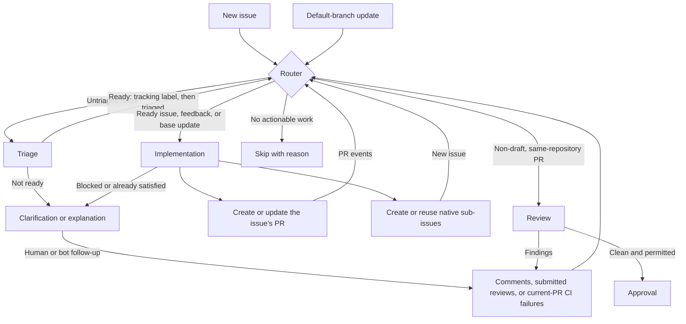

# Factory

An agentic software factory experiment, starting with small CI milestones:

- [x] Run GitHub Copilot CLI in CI
- [x] Read and write repository content, issues, and PRs from CI
- [x] Review PRs and post comments or approvals
- [x] Turn issues and follow-up comments into PRs or Factory replies

## Factory workflow

The [router](docs/factory/factory-router.md) sends events to Copilot workers for
triage, implementation, or review. It skips irrelevant events; workers check
current state and verify their results.

Triage adds `factory-issue-<number>` before `triaged` to hand off a ready issue.
Implementation chooses one focused PR or native sub-issues, without duplicating
child work in a parent PR. Children enter normal triage with their own identity.

Copilot makes the routing and worker decisions. People and other bots provide
input under their own accounts. The router runs as `github-actions[bot]`;
Factory work uses `factory-worker-bot[bot]`, and reviews use
`factory-reviewer-bot[bot]`. Running in Actions does not change an App's authorship.

Implementation keeps eligible PRs current with the default branch and resolves
conflicts, but never merges PRs or closes issues. Each implementation worker
handles only its assigned issue/PR.
See [implementation guidance](docs/factory/issue-implementation.md) for eligibility,
ownership, split recovery, and verification.

**Before-merge risk:** submitted reviews run the router from the PR merge revision.
Router/setup changes can therefore execute before merge with the router's token.
Other events and workers use the default branch. See the
[accepted risk](docs/factory/factory-router.md#accepted-risk-router-changes-can-run-before-merge).

## Workflow diagnostics

[Workflow diagnostics](docs/factory/workflow-diagnostics.md) examines same-repository
workflow runs with parallel read-only subagents. Its first invocation records a
boundary without analysis; later runs look for actionable improvements.

## Repository review

[Repository review](docs/factory/repository-review.md) reads the whole source
snapshot from scratch, without executing or changing it.

Both workflows run daily at **00:00 UTC** or manually on the default branch.
They check issues and PRs in all states for duplicates, publish only new actionable
findings as unlabeled Factory issues for triage, and report coverage and gaps in
the job summary.

## CI examples

These are reusable snippets, not installed workflows. Basic examples use the
built-in token and need no PAT or custom secret. Factory uses
[GitHub Apps](docs/factory/github-app.md) for downstream events and separate
author/reviewer identities.

1. [Install AI tools and run a prompt](docs/examples/ai-tools.md)
2. [Create a pull request](docs/examples/create-pull-request.md) - tested successfully.
3. [Create an issue](docs/examples/create-issue.md) - tested successfully.

## Factory guidance

Worker contracts and live-verification limits live in [docs/factory/](docs/factory/).
Start with [routing](docs/factory/factory-router.md), [triage](docs/factory/issue-triage.md),
[implementation](docs/factory/issue-implementation.md), or [PR review](docs/factory/pr-review.md).
Contributor expectations are in [AGENTS.md](AGENTS.md).
