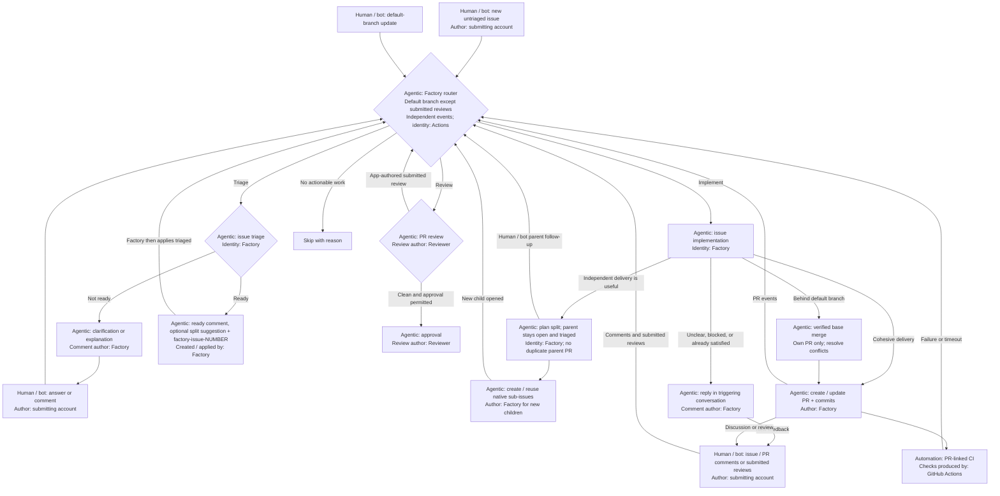
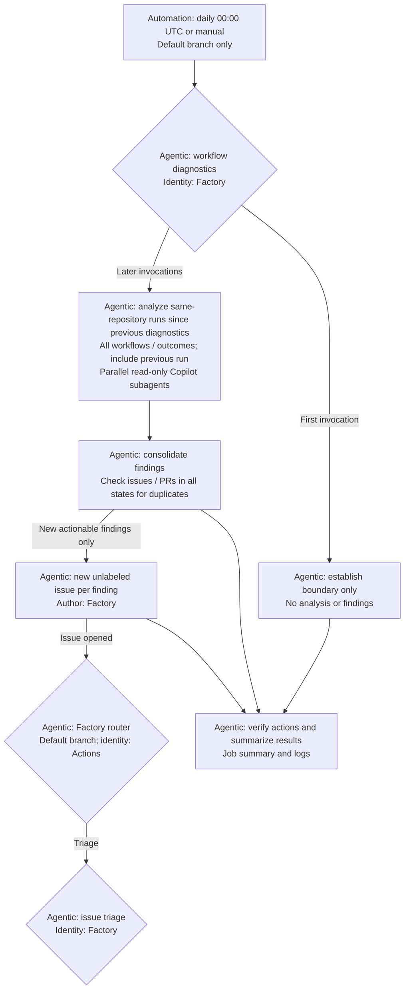
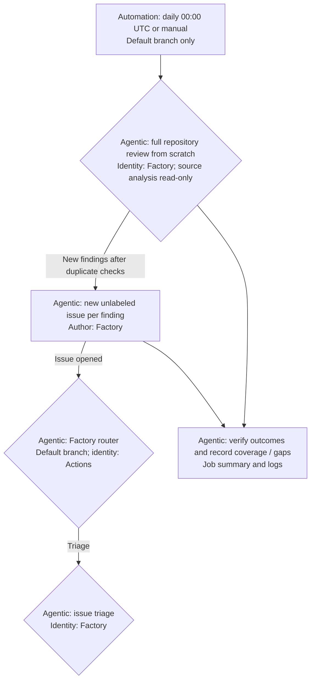

# Factory

## Agentic Software Factory experiment
Starting with small things:

- [x] Run GitHub Copilot CLI in CI Job
- [x] Have GitHub Copilot CLI on CI read/write repo/issues/PRs
- [x] Review PRs with GitHub Copilot CLI in CI and post comments or approval
- [x] Turn issues and user follow-up comments into PRs or Factory replies

## Factory workflow

The [Factory router](docs/factory/factory-router.md) analyzes events and dispatches triage,
review, or implementation on the default branch. Router runs are independent;
workers own issue/PR concurrency and AI-led freshness checks. Setup checkouts use
the workflow's exact revision. Submitted reviews directly run the PR-revision
router, so router/setup changes can execute before merge; see the
[accepted risk](docs/factory/factory-router.md#accepted-risk-router-changes-can-run-before-merge).

Triage applies the unique `factory-issue-<number>` tracking label before `triaged`
enters routing for implementation. Triage may suggest decomposition in its comment
but creates no issues. Implementation chooses a focused PR or native sub-issues.
A PR carries both labels; a split parent stays open with its existing labels.
Each child enters normal triage and receives its own tracking identity when ready.

**Actors:** Agentic blocks use Copilot in CI; human / bot input can come from a
human or another bot under its own account. Automation denotes CI runs and checks.

**Identities:** Factory = `factory-worker-bot[bot]`;
Reviewer = `factory-reviewer-bot[bot]`; Actions = `github-actions[bot]`.
Running in Actions does not make App-created content Actions-authored.

PR review runs on non-draft, same-repository PRs. Follow-ups require an open,
triaged issue and, when present, a matching open Factory PR. CI must match the
PR's current head or merge revision. Factory does not automatically merge PRs
or close issues. Implementation reuses existing child work on retries and does
not duplicate it in a parent PR. Parent comments resume partial splits through
the same implementation route; see [issue implementation](docs/factory/issue-implementation.md).

Default-branch updates dispatch maintenance for all eligible Factory PRs; each
worker handles only its assigned PR. Whenever a PR is behind the current default
branch, implementation merges it and resolves any conflicts, including on ordinary
follow-ups. Verified merges preserve both histories and intended changes. Push-only
maintenance skips without PR comments only when the PR already includes the current
default branch and there are no changes, outstanding feedback, errors, or blockers.
Conflicts that cannot be resolved safely get a specific blocker on the PR.

## Periodic recovery

[Factory maintenance](docs/factory/factory-maintenance.md) runs hourly at minute
17 UTC or manually on the default branch. It discovers missed or interrupted
triage handoffs, implementation, reviews, feedback, and default-branch updates,
then dispatches the existing workers using the router's
[shared policy](docs/factory/routing-policy.md).

The coordinator uses the built-in token for read-only discovery and workflow
dispatch, not comments, labels, code changes, or new issues/PRs. It reconciles
active/handled work across sweeps and ordinary routing, respects human/approval
holds and child-owned scope, and reports coverage, dispatch evidence, and partial
failures in the job summary. Dispatch acceptance is not completed recovery.
Scheduled delivery, overlap handling, and retry recovery still need post-merge
live verification.

## Workflow diagnostics

[Workflow diagnostics](docs/factory/workflow-diagnostics.md) analyzes past workflow runs
separately from the main Factory workflow. New unlabeled findings issues enter the
[Factory workflow](#factory-workflow) through the router and normal issue triage.

## Repository review

[Repository review](docs/factory/repository-review.md) runs daily at 00:00 UTC or manually,
reviewing the whole source snapshot from scratch.
It checks existing issues/PRs before publishing new actionable findings for triage,
and records the reviewed commit, coverage, issue links, and gaps in the job summary.

## CI examples

The AI setup and issue/PR-creation examples in [docs/examples/](docs/examples/)
are reusable snippets, not installed workflows. The basic examples use this
repository's scripts and require no PAT or custom secret. App-based PR creation uses the
[GitHub App setup](docs/factory/github-app.md) with `FACTORY_CLIENT_ID` and
`FACTORY_PRIVATE_KEY` for automatic downstream runs and distinct PR author/reviewer
identities.
PR review uses a separate App with `FACTORY_REVIEWER_CLIENT_ID` and
`FACTORY_REVIEWER_PRIVATE_KEY`; see [App setup](docs/factory/github-app.md#configure-the-apps).
Its native submitted-review handoff still needs post-merge live verification.

- `scripts/install-tools.sh copilot` or `opencode` installs only that standalone CLI
  via its official script (no Node.js/npm setup), plus missing `jq`. Omitting the
  argument installs both; the shared action installs only its selected harness.
- `scripts/ai.sh` reads `.github/model-config.json` and invokes the selected CLI.
- Factory workflows share the [Run AI action](docs/examples/ai-tools.md#shared-factory-action)
  for installation and invocation; checkout, credentials, and result checks stay
  in each workflow.
- `GITHUB_TOKEN: ${{ github.token }}` authenticates both Copilot model requests and
  the `gh` commands in the basic examples. App-based PR creation sets `GH_TOKEN`
  to the App token and `COPILOT_GITHUB_TOKEN` to the built-in token: three standard
  variable names, two credentials. See [token names and identities](docs/factory/github-app.md#token-names-and-identities)
  for tool precedence and separate Git push authentication.

1. [Install AI tools and run a prompt](docs/examples/ai-tools.md)
2. [Create a pull request](docs/examples/create-pull-request.md) — tested successfully.
3. [Create an issue](docs/examples/create-issue.md) — tested successfully.

## Factory guidance

Active workflow instructions and shared App setup live in [docs/factory/](docs/factory/).

The router dispatches PR review on PR events. Issue triage assesses new
issues and clarification comments; implementation handles triaged issues and
feedback on their Factory PRs. See
[GitHub's Copilot CLI Actions guide](https://docs.github.com/en/copilot/how-tos/copilot-cli/use-copilot-cli-in-actions).
Workflow diagnostics runs daily at 00:00 UTC or manually. Copilot selects the
same-repository run window, analyzes workflows with parallel subagents, and sends
actionable findings through triage. It verifies its actions and summarizes results
in the job summary and logs.

1. [Factory GitHub App setup](docs/factory/github-app.md)
2. [PR review](docs/factory/pr-review.md) — reviewer-App live verification pending.
3. [Triage issues before implementation](docs/factory/issue-triage.md)
4. [Implement a triaged issue or decompose it into sub-issues](docs/factory/issue-implementation.md)
5. [Diagnose workflow runs and create actionable issues](docs/factory/workflow-diagnostics.md)
6. [Route events to default-branch workers](docs/factory/factory-router.md)
7. [Review the whole repository and create actionable issues](docs/factory/repository-review.md)
8. [Recover unattended lifecycle work](docs/factory/factory-maintenance.md)
9. [Shared worker eligibility and dispatch rules](docs/factory/routing-policy.md)
