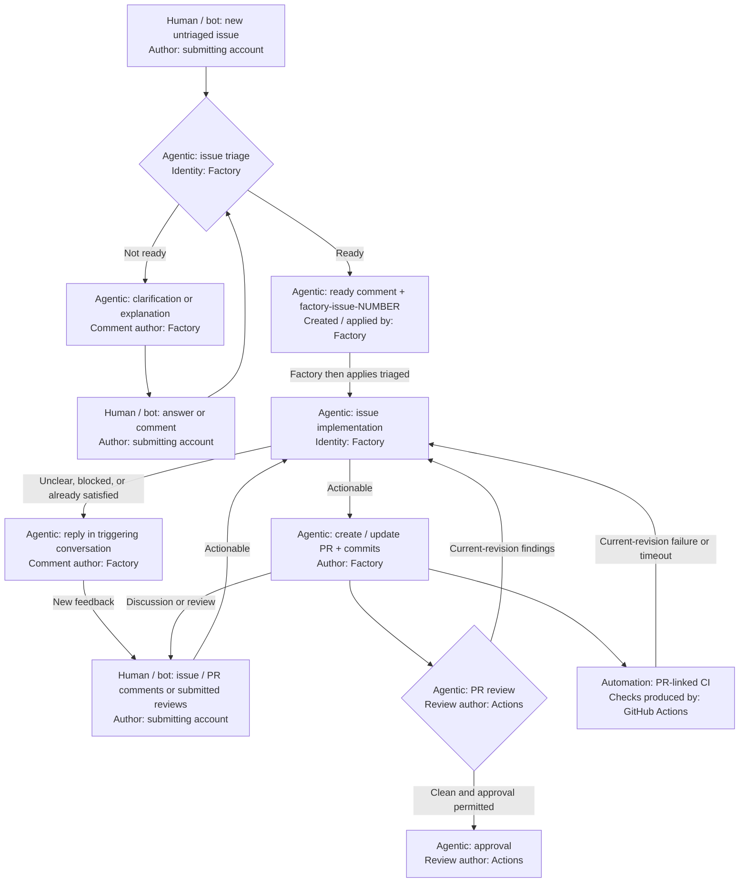

# Factory

## Agentic Software Factory experiment
Starting with small things:

- [x] Run GitHub Copilot CLI in CI Job
- [x] Have GitHub Copilot CLI on CI read/write repo/issues/PRs
- [ ] Review PRs with GitHub Copilot CLI in CI and post comments or approval
- [ ] Turn issues and user follow-up comments into PRs or Factory replies

## Factory workflow

Triage applies the unique `factory-issue-<number>` tracking label before `triaged`
starts implementation. The resulting Factory PR carries both labels.

**Actors:** Agentic blocks use Copilot in CI; human / bot input can come from a
human or another bot under its own account. Automation denotes CI runs and checks.

**Identities:** Factory = `factory-identity[bot]`; Actions = `github-actions[bot]`.
Running in Actions does not make Factory-created content Actions-authored.

PR review runs on non-draft, same-repository PRs. Follow-ups require an open,
triaged issue and, when present, a matching open Factory PR. CI must match the
PR's current head or merge revision. Factory does not automatically merge PRs
or close issues.

## CI examples

The basic examples use this repository's scripts and require no PAT or custom secret.
The PR-creation CI uses the [GitHub App setup](docs/github-app.md)
with `FACTORY_CLIENT_ID` and `FACTORY_PRIVATE_KEY` to enable automatic runs and
distinct PR author/reviewer identities.

- `scripts/install-tools.sh` installs Copilot CLI, OpenCode, and missing `jq`.
- `scripts/ai.sh` reads `.github/model-config.json` and invokes the selected CLI.
- `GITHUB_TOKEN: ${{ github.token }}` authenticates both Copilot model requests and
  the `gh` commands in the basic examples. App-based PR creation sets `GH_TOKEN`
  to the App token and `COPILOT_GITHUB_TOKEN` to the built-in token.

Run the manual examples from **Actions → CI → Run workflow** once the workflow is
on the default branch. PR review runs on PR events. Issue triage assesses new
issues and clarification comments; implementation handles triaged issues and
feedback on their Factory PRs. See
[GitHub's Copilot CLI Actions guide](https://docs.github.com/en/copilot/how-tos/copilot-cli/use-copilot-cli-in-actions).

1. [Install AI tools and run a prompt](docs/ai-tools.md)
2. [Create a pull request](docs/create-pull-request.md) — tested successfully.
3. [Create an issue](docs/create-issue.md) — tested successfully.
4. [PR review](docs/pr-review.md) — comment reviews tested successfully; approvals pending.
5. [Triage issues before implementation](docs/issue-triage.md)
6. [Turn a triaged issue or follow-up comment into a PR](docs/issue-implementation.md)
